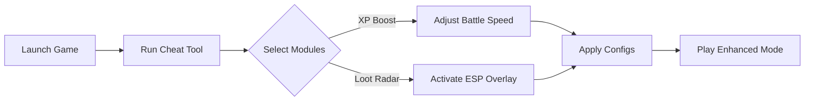

# Digimon Story Time Stranger Cheat Tool ⚡

Enter the digital realm with **Digimon Story Time Stranger Cheat**, a next-gen enhancement suite that gives you **total control over XP, loot, and battle flow**. Whether you want to grind smarter, skip repetitive combat, or customize evolution paths, this tool brings flexibility and dominance to your gameplay — all within a secure, user-friendly interface.

---

## 🧩 Overview

The **Digimon Story Time Stranger Cheat Tool** was built for both explorers and competitive players. It’s not just a “trainer” — it’s a **modular command center** that enhances XP acquisition, drop rates, and evolution control. You’ll gain fine-grained power over combat sequences and loot structures, while keeping gameplay smooth and responsive.

[!NOTE]
This cheat supports **offline and story modes only** by default. Custom server play requires manual module approval.

---

## ⚙️ Features

### 🧠 Smart XP & Evolution Control

* **Instant Level Sync:** Level up your Digimon instantly to match your highest creature.
* **Evolution Bypass:** Unlock any form after requirements are viewed once.
* **Battle Flow Mod:** Auto-complete trivial fights to save time on grinding.

### 💰 Loot Farming Suite

* **Drop Multiplier:** Up to ×5 drop rate for rare components or crests.
* **Item Tracker:** View all possible rewards in your region via radar overlay.
* **Auto-Loot Pulse:** Collect and sort items instantly after combat.

### 🔮 Visual & Data Enhancements

* **ESP Overlay:** Display active Digimon stats, enemy resistances, and distance.
* **Resource Radar:** Shows hidden chests and data fragments on the minimap.
* **Custom Filters:** Toggle visibility for consumables, accessories, or crafting parts.

### 🧩 Configurable Automation

You can define macros using `.digicfg` scripts:

```bash
set xp_boost=3x
set auto_battle=true
set loot_filter=rare_only
```

Each config can be switched mid-session with **CTRL + F7** — no restart needed.

---

## 🖥 Compatibility

| Feature           | Supported               | Notes                      |
| ----------------- | ----------------------- | -------------------------- |
| **Platform**      | Steam / Epic Games      | Works with official builds |
| **OS**            | Windows 10/11           | 64-bit required            |
| **Display Mode**  | Fullscreen / Borderless | Overlay auto-adjusts DPI   |
| **Languages**     | EN, JP, FR, DE          | UTF-8 compatible interface |
| **Input Support** | Controller & KBM        | Fully remappable hotkeys   |

[!IMPORTANT]
If using HDR or adaptive sync, enable **Overlay Safe Mode** in settings to prevent flicker.

---

## ⚡ Setup Guide

To install the **Digimon Story Time Stranger Cheat Tool**, follow these quick steps:

1. **Download** and extract the latest `.zip` build.
2. Launch **Digimon Story Time Stranger** and wait at the main menu.
3. Run the trainer as administrator.
4. Select desired modules (XP Boost, Loot, ESP, etc.).
5. Press **F9** to activate; your HUD will update with active modules.

Example command for auto-load:

```bash
digistranger.exe --profile=auto_loot.cfg --silent
```

---

### 🧭 Process Diagram (Mermaid)



---

## 💬 FAQ

**Q1: Is it safe to use online?**

> It’s built for offline campaign use. Multiplayer modules are disabled by default for fair play.

**Q2: Will it affect save files?**

> No direct modification occurs; all boosts are applied in runtime memory and reset upon exit.

**Q3: Can I customize drop rates?**

> Yes — edit your `loot_config.json` file. You can scale values per Digimon type.

**Q4: Does it cause lag or crashes?**

> The system uses async hooks, meaning no FPS drops even when radar or ESP are active.

**Q5: How often is it updated?**

> Biweekly updates with patch syncs and new Digimon compatibility releases.

---

## 🔔 Final Thoughts

The **Digimon Story Time Stranger Cheat Tool** transforms the grind into pure adventure. With rapid XP control, advanced loot automation, and dynamic ESP visualization, you gain strategic awareness and complete creative control over every encounter. It’s efficient, safe, and flexible — the ultimate companion for the digital frontier.

---
